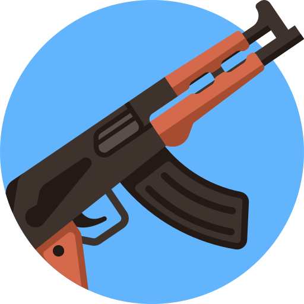

# Weapon-Upgrader

## Overview

### This project revolves around the acquisition of weapon upgrades for Call of Duty. Through a user-friendly form, you can effortlessly choose your desired upgrades, and upon submitting the form, the total price of the upgrades will be displayed. 

---

**Live demo:** [weapon-upgrader](http://afektheminilearner.github.io/weapon-upgrader)

**Command lines:**

- `npm install`   Install all the necessary packages for running and developing the project.
- `npm run start`  For running the project.

---

### **Take a glimpse into the app:**

---

### The technologies used in this project include:

- [x] _**ReactJS**_ : the project is built on the _ReactJS_ framework.
- [x] _**Formik**_ : the form within the app is powered using _Formik_, ensuring optimal performance and functionality.
- [x] _**Yup**_ : the form's field validations in _Formik_ are implemented using _Yup_.
- [x] _**styled-components**_ : the project's styling is implemented using _styled-components_.
- [x] _**Mui v5**_ : the project has been built using _MUI v5_.
- [x] _**ESLINT**_ : the project adheres to the _ESLint_ guidelines and follows the best practices recommended by _airbnb_.

---

## Author

:octocat: **Afek Sakaju**

- LinkedIn: [@afeksa](https://www.linkedin.com/in/afeksa/)
- GitHub: [@afekTheMiniLearner](https://github.com/afekTheMiniLearner)
