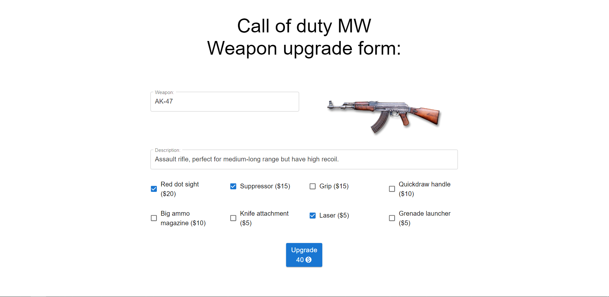

# Weapon-upgrade-form

## Overview

### This project is about purchasing call of duty weapon upgrades. With a simple form, you can conveniently select your desired upgrades, and the total price will be displayed after submitting the form. 

---

**Live demo:** [weapon-upgrade-form](http://afektheminilearner.github.io/weapon-upgrade-form)

**Installation:** 
_`npm install`_

**Running the project:** 
_`npm run start`_

---

### **Example of using the project:**

---

### **Technology**

### This project has been developed using ReactJS, JavaScript,Formik, Mui v5, styled-components, ESLINT. The project is also adapted to fit smaller screens using media queries. 

---

## Author

:octocat: **Afek Sakaju**

- LinkedIn: [@afeksa](https://www.linkedin.com/in/afeksa/)
- GitHub: [@afekTheMiniLearner](https://github.com/afekTheMiniLearner)
